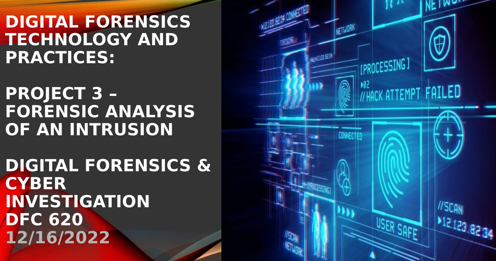

# Forensic Analysis of an Intrusion

## Overview
Forensic investigation of a simulated system intrusion focused on log analysis, persistence mechanisms, and evidence of data exfiltration.  
The project reconstructs attacker activity and produces analyst-ready findings aligned with DFIR workflows.

## Why This Project Matters to SOC Teams
- Demonstrates post-incident investigation and evidence handling
- Identifies persistence and exfiltration artifacts
- Supports escalation, containment, and remediation decisions

## Environment
- OS: Windows
- Data Sources: IIS logs, startup folder artifacts, scheduled tasks
- Tools: Autoruns, log analysis utilities, file system inspection
- Frameworks: DFIR investigation workflow

## Data Collected / Artifacts
- IIS web server logs
- Startup folder persistence artifacts
- Scheduled task configurations
- Exfiltration indicators
- Indicators of Compromise (IOCs)

## Analysis Steps
1. Reviewed IIS logs to identify suspicious access patterns
2. Inspected startup and autorun locations for persistence mechanisms
3. Analyzed scheduled tasks for unauthorized execution
4. Identified evidence of outbound data exfiltration
5. Correlated artifacts to reconstruct an intrusion timeline

## Findings
- Persistence mechanisms confirmed via startup artifacts
- Scheduled tasks used to maintain access
- Logs revealed malicious access patterns
- Evidence supported outbound data exfiltration activity

## Outcome
- Intrusion timeline successfully reconstructed
- Confirmed compromise involving persistence and exfiltration
- Recommended remediation and monitoring improvements

## Evidence
- Investigation screenshots and artifacts stored in `/images`
- Full forensic analysis documented in PDF

## Project Files
- `Digital_Forensics_Project3_Forensic_Analysis_of_an_Intrusion.pdf`
- `/images`

## Skills Demonstrated
- Digital forensics analysis
- Log correlation and timeline reconstruction
- Windows artifact investigation
- Incident response fundamentals
- Evidence-based reporting

## Author
**Niknaz Sadehvandi**  
**Cybersecurity Analyst**
