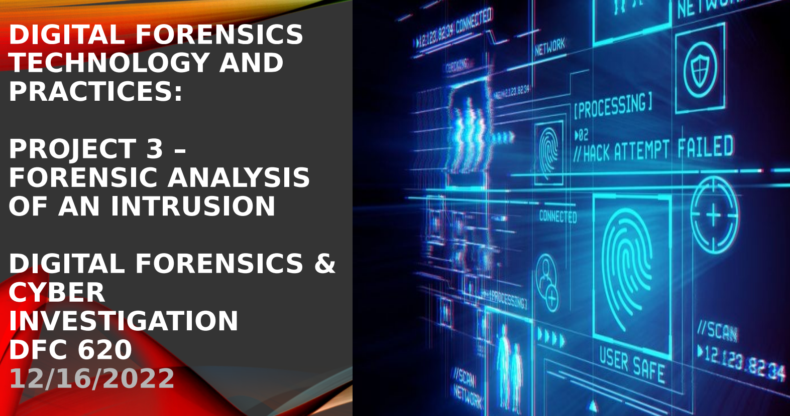

# Forensic Analysis of an Intrusion

## Overview
Forensic investigation of a simulated Windows system intrusion focused on log analysis, persistence mechanisms, and evidence of data exfiltration.

This project reconstructs attacker activity and produces analyst-ready findings aligned with standard DFIR workflows.

## Why This Project Matters
- Demonstrates full post-incident investigation and evidence handling
- Identifies persistence and exfiltration artifacts
- Supports escalation, containment, and remediation decisions

## Environment
- **OS**: Windows
- **Data Sources**: IIS logs, Startup folder, Scheduled Tasks
- **Tools**: Autoruns, log analysis tools, file system inspection
- **Frameworks**: NIST / SANS DFIR methodology

## Analysis Steps
1. Reviewed IIS logs for suspicious access patterns
2. Inspected startup folder and autorun locations for persistence
3. Analyzed scheduled tasks for unauthorized execution
4. Identified evidence of outbound data exfiltration
5. Correlated artifacts to build a complete intrusion timeline

## Findings
- Persistence mechanisms via startup folder artifacts
- Scheduled tasks used for maintaining access
- Malicious patterns identified in IIS logs
- Confirmed outbound data exfiltration activity

## Outcome & Recommendations
- Successfully reconstructed the intrusion timeline
- Confirmed compromise involving persistence and exfiltration
- Recommended remediation: application whitelisting, enhanced monitoring of startup locations and scheduled tasks, and network egress filtering

## Project Files
- **[Digital-Forensics-Project3-Forensic-Analysis-of-an-Intrusion.pdf](Digital-Forensics-Project3-Forensic-Analysis-of-an-Intrusion.pdf)** — Full forensic report with detailed analysis and screenshots

## Evidence
Screenshots and supporting artifacts are available in the [`images/`](images/) folder (add your screenshots here).

## Skills Demonstrated
- Digital Forensics & Incident Response (DFIR)
- Windows artifact analysis (IIS logs, autoruns, scheduled tasks)
- Log correlation and timeline reconstruction
- Evidence-based reporting
- Threat actor TTP identification

---

**Author**  
**Niknaz Sadehvandi** (Nikki)  
Cybersecurity Analyst | SOC Monitoring | Threat Hunting | DFIR

